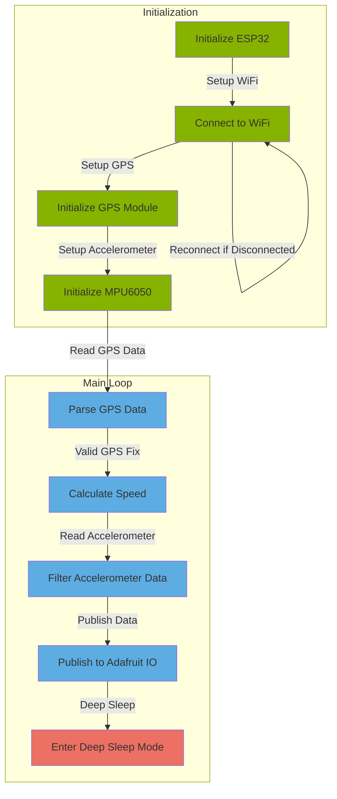

# Vehicle Monitoring with ESP32, GPS, and Accelerometer

## Table of Contents

- [Overview](#overview)
- [Components](#components)
- [Dependencies](#dependencies)
- [Setup](#setup)
  - [Wiring](#wiring)
  - [WiFi Configuration](#wifi-configuration)
  - [Adafruit IO Setup](#adafruit-io-setup)
  - [Upload the Code](#upload-the-code)
- [Operation](#operation)
- [Data Visualization](#data-visualization)
- [Power Management](#power-management)
- [Additional Notes](#additional-notes)
- [Flowchar](#flowchart)

## Overview

This project utilizes an ESP32 microcontroller, a GPS module, and a 6-axis accelerometer (GY-521) to monitor and publish real-time data about a moving vehicle. The data includes GPS coordinates, vehicle speed, and filtered accelerometer information.

## Components

- **ESP32 DevKit v1:** Microcontroller for processing and communication.
- **GPS Module:** Provides latitude, longitude, and speed data.
- **GY-521 6-Axis Accelerometer:** Measures acceleration and orientation.

## Dependencies

- [Adafruit GPS Library](https://github.com/adafruit/Adafruit_GPS)
- [Adafruit MPU6050 Library](https://github.com/adafruit/Adafruit_MPU6050)

Ensure that these libraries are installed in your Arduino IDE.

## Setup

1. ### Wiring

   - Connect the GPS module and GY-521 accelerometer to the ESP32 using appropriate pins.
   - Refer to the comments in the code for pin configurations.

2. ### WiFi Configuration

   - Update the `WIFI_SSID` and `WIFI_PASS` variables in the code with your WiFi credentials.

3. ### Adafruit IO Setup

   - Create an account on [Adafruit IO](https://io.adafruit.com/).
   - Set up feeds for GPS, Speed, and Acceleration.
   - Update the MQTT configuration variables (`MQTT_SERVER`, `MQTT_PORT`, `MQTT_USERNAME`, `MQTT_KEY`) with your Adafruit IO information.

4. ### Upload the Code

   - Upload the modified code to your ESP32 using the Arduino IDE.

## Operation

- The ESP32 reads GPS data, including latitude, longitude, and speed.
- Accelerometer data is filtered using a complementary filter to obtain accurate pitch and roll.
- The filtered data (GPS, speed, and accelerometer) is published to Adafruit IO via MQTT.

## Data Visualization

- Monitor your vehicle's data in real-time on the Adafruit IO dashboard.
- View GPS coordinates, speed, and filtered accelerometer information.

## Power Management

- The code includes a deep sleep mode to minimize power consumption during idle periods.
- Adjust the sleep duration based on your application's requirements.

## Additional Notes

- This code is a foundation for vehicle monitoring. Customize it based on your specific needs.
- Refer to the comments in the code for detailed explanations of configurations and adjustments.

## Flowchart

